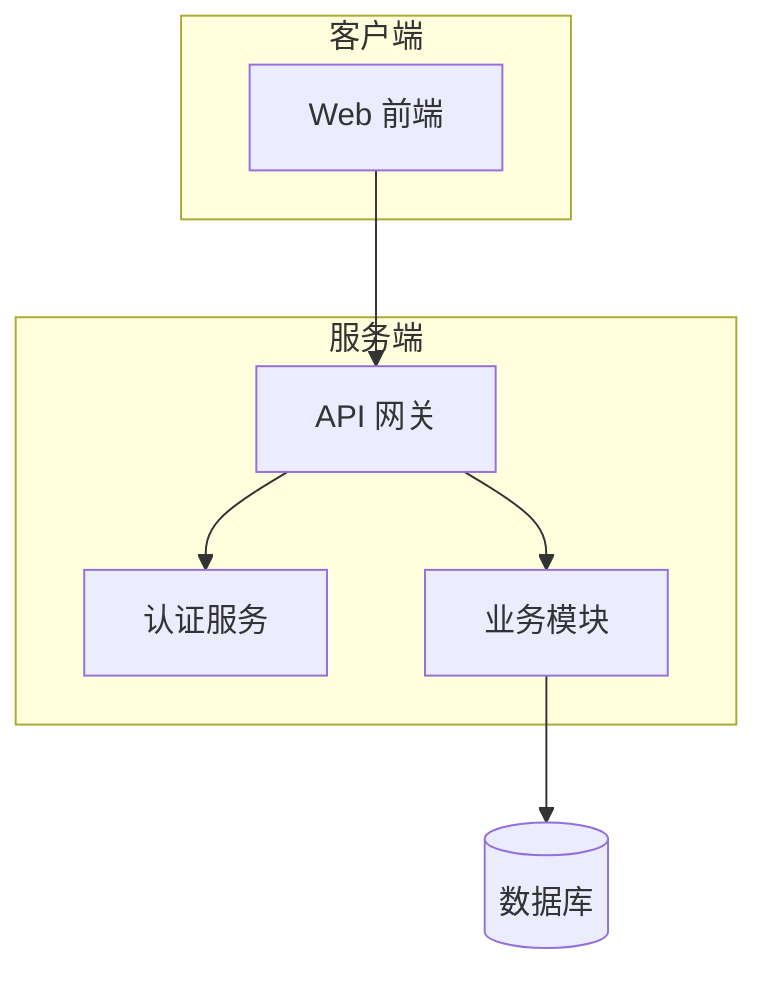
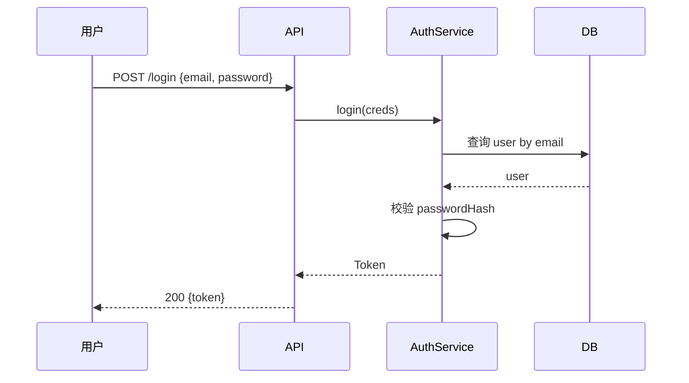
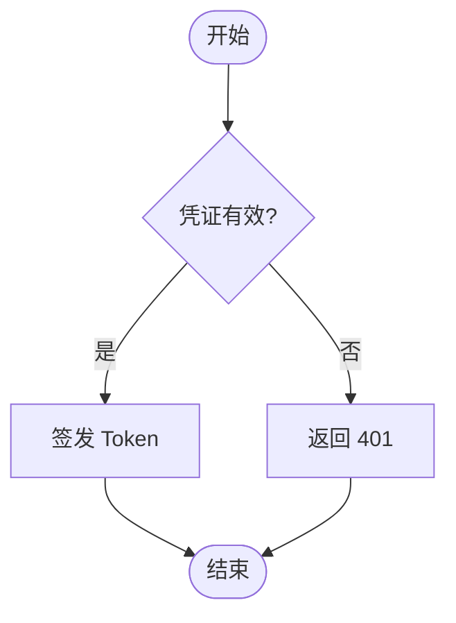
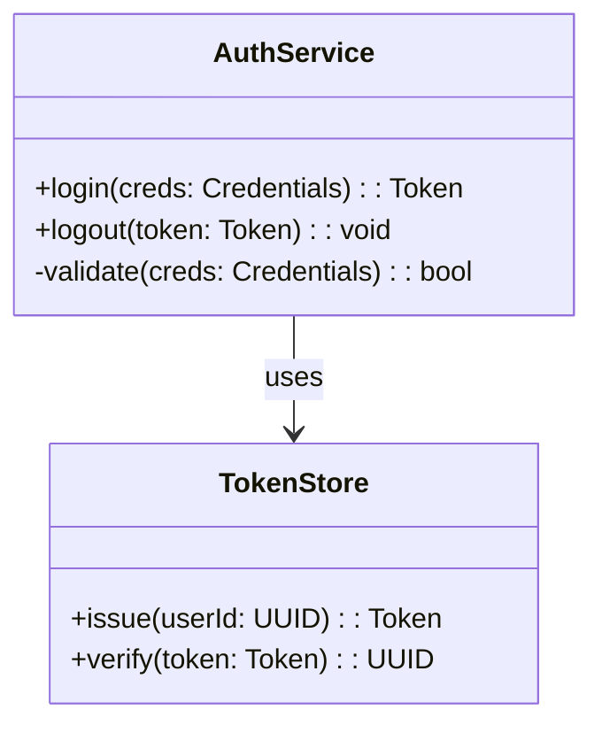
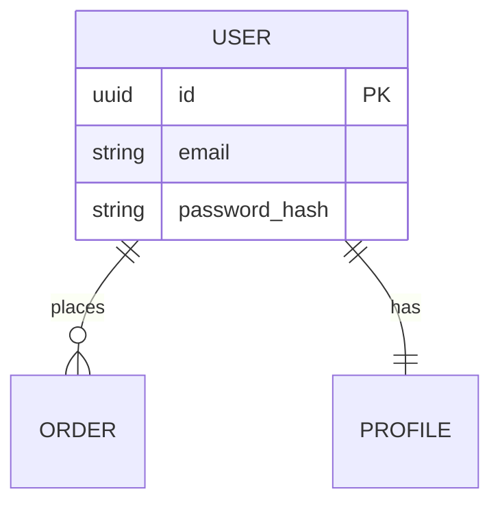

# 方案填写规范与 mermaid 示例

> 每章填法 + 各类图的 mermaid 代码示例 + 前端交互设计的 ASCII 示例。
> 「方案模板.md」是填空蓝本，本文件是格式规范，两者配套、章节一致。
> mermaid 语法关键字（graph/sequenceDiagram/classDiagram/erDiagram 等）无法中译，保留。

## 第 1 章 方案概览
一段话讲清：目标（对齐 requirement 第 1 章目标）、核心思路、关键决策摘要（指向第 2 章与 ADR）、功能拆分概览（指向第 4 章）。不展开细节。

## 第 2 章 技术选型
用表格列每个决策点的「选定方案 / 被否方案 / 理由」。被否方案必须留痕。重大选型在此指向 ADR（第 8 章）。

## 第 3 章 总体设计 — mermaid 架构图 + 核心数据流
画出模块/分层/部署关系，每个节点一句话职责写在图下，再补端到端核心数据流。



- 节点用方括号 `[名称]`，数据库用 `[(名称)]`，子图用 `subgraph`。
- 关系标注：`A -->|标注| B`。

## 第 4 章 功能设计 — 按功能拆分（本方案核心）

对齐 requirement 功能范围，每个功能一节，含三部分：

### (a) 功能概述
- 标注**类型：新增 / 改动**（每个功能必须二选一）。
- 目标、输入/输出、参与模块。
- **改动清单**（仅「改动」类型必填）：用表格列改动对象/类型(修改·新增方法·删除)/改动内容/影响范围。新增类型写「无」。供 dev-review 核对影响面。

### (b) 功能流程图或时序图
分支逻辑用流程图，交互顺序用时序图。

时序图：

- `->>` 实线箭头（请求），`-->>` 虚线箭头（响应）。`participant` 声明参与方，`as` 起别名。

流程图（分支）：


### (c) 具体的功能设计
含三块，按需取用：

**交互设计**（可选：仅涉及前端的功能加，用 ASCII 体现界面布局与交互流程；后端/无界面功能省略）

界面布局示例：
```text
┌─────────────────────────────┐
│  登录                        │
│  ┌─────────────────────┐    │
│  │ 邮箱                 │    │
│  └─────────────────────┘    │
│  [ 登录 ]                    │
└─────────────────────────────┘
```
交互流程示例（状态切换）：
```text
[输入] → 点击登录 → loading → 成功→跳转主页
                           └→ 失败→错误提示(可重试)
```

**类设计**（可选：有则加 mermaid 类图 + 职责表，无则省）


- 方法语法：`+方法名(参数) 返回类型`（`+` public、`-` private、`#` protected）。类名与方法名不可用花括号占位符，须填实际名称。
- 关系：`-->` 依赖、`--|>` 继承、`*--` 组合、`o--` 聚合。

职责表：列出每个类的单一职责与关键方法，避免类承担过多。

**涉及函数 + 关键逻辑伪代码**：函数签名 + 核心算法伪代码（描述思路，非最终代码）。

## 第 5 章 数据设计与接口设计 — 结构化（跨功能共享部分）

> 功能内部专属的数据/接口可留在第 4 章对应功能的 (c) 里，本章只放全局共享部分。强制结构化，dev-implement 据此实现，dev-review 据此核对。

### 5.1 数据设计 — 数据模型 + ER 图

字段定义：
```text
模型: User
字段:
  - id: UUID PK
  - email: string UNIQUE NOT NULL
  - passwordHash: string NOT NULL
索引:
  - idx_user_email on (email)
```

ER 图：

- 关系基数：`||--||` 一对一、`||--o{` 一对多、`}o--o{` 多对多。
- 实体内字段用 `类型 名称 PK/FK`（PK/FK 为 mermaid 语法，保留）。

### 5.2 接口设计 — 结构化契约

签名 + 请求/响应类型 + 错误。不可用纯文字描述。
```text
接口: POST /api/login
请求:
  type LoginRequest = { email: string; password: string }
响应:
  type LoginResponse = { token: string; expiresIn: number }
错误:
  401 INVALID_CREDENTIALS — 邮箱或密码错误
  429 RATE_LIMITED — 触发限流
```
> 内部模块用函数签名形式：`login(req: LoginRequest): Promise<LoginResponse>`。

### 5.3 类设计 — 跨功能类图 + 职责
跨功能的类结构与职责（功能内部专属类归第 4 章），mermaid 类图 + 职责表，语法同第 4 章 (c)。

## 第 6 章 影响面与风险
影响面：列出改动触及的现有模块/接口/数据/迁移（与各功能第 4 章改动清单汇总呼应）。风险：性能/兼容/数据迁移/外部依赖，每条带缓解措施。

## 第 7 章 回滚策略
说明回滚方式（feature flag / 版本兼容 / 迁移可逆）与具体步骤。数据迁移必须考虑可逆性。

## 第 8 章 关联 ADR
用链接列出本方案的重大决策 ADR，每条一句话说明决策。跨功能决策指向 `develop/adr/`，功能级指向 `features/{f}/adr/`。
