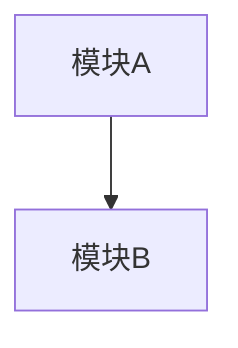
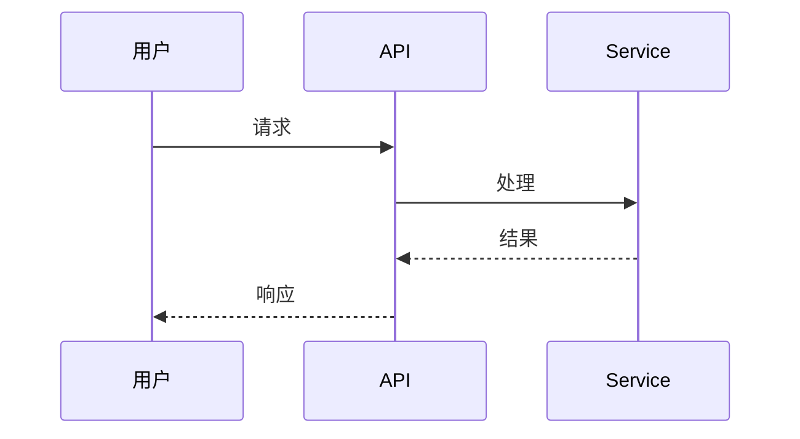
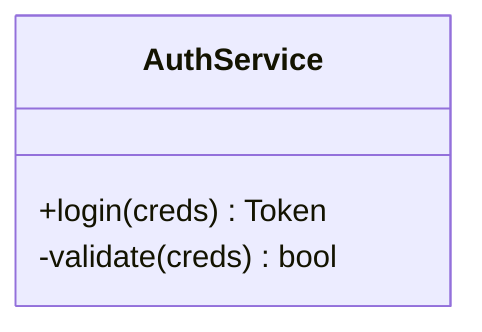
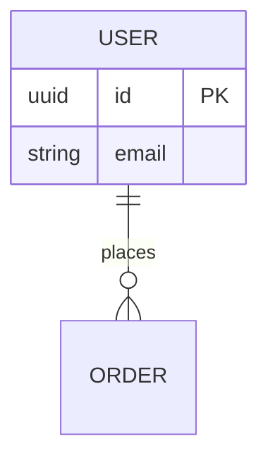

# {feature} — 技术方案设计

> 产物路径：`develop/features/{feature}/{feature}-design.md`
> 上游：{feature}-requirement.md、project-context.md
> 下游：dev-implement 据第 3/4/5 章拆任务写测试；dev-review 据全文核对实现。
> 填法与 mermaid 示例见「方案填写规范.md」。

## 1. 方案概览

- **目标**：（一句话方案目标，对齐 requirement 第 1 章目标）
- **核心思路**：
- **关键决策摘要**：（指向第 2 章与 ADR）
- **功能拆分概览**：（本方案拆为哪几个功能，指向第 4 章）

## 2. 技术选型（含被否方案及理由）

| 决策点 | 选定 | 被否方案 | 理由 |
|---|---|---|---|

> 重大选型在此处指向 ADR（见第 8 章）。

## 3. 总体设计

> 整体架构：模块/分层/部署关系与核心数据流。用 mermaid 架构图表达，再配一句话职责说明。



**说明**：（图中各模块一句话职责）

**核心数据流**：（端到端数据如何在模块间流动，可用 mermaid 或文字）

## 4. 功能设计

> 按功能逐个拆分。每个功能包含 (a) 功能概述、(b) 功能流程图或时序图、(c) 具体的功能设计。
> 功能划分对齐 requirement 的功能范围，一个功能对应需求的一个可独立交付单元。

### 4.1 功能：{功能名} — [新增|改动]

> 标注本功能是**新增**还是**改动**。新增功能无改动清单；改动功能必须列出改动清单。

#### (a) 功能概述
- **类型**：新增 / 改动
- **目标**：（该功能交付什么，对齐哪条验收标准）
- **输入/输出**：（触发与产出）
- **参与模块**：（涉及第 3 章哪些模块）

**改动清单**（仅「改动」类型必填，「新增」类型写「无」）
> 列出本功能对现有代码/接口/数据的改动点，每条标明改动对象与改动内容。供 dev-review 核对影响面。

| 改动对象 | 类型 | 改动内容 | 影响范围 |
|---|---|---|---|
| `src/auth/login.ts` | 修改 | 登录返回新增 refreshToken | 接口契约变更，影响前端 |
| `users` 表 | 修改 | 新增 lastLoginAt 字段 | 数据迁移 |
| `LogoutService` | 新增方法 | 增加 forceLogout | — |

#### (b) 功能流程图或时序图
> 用 mermaid 画该功能的关键流程（分支逻辑用流程图，交互顺序用时序图）。



**流程说明**：（图关键步骤一句话）

#### (c) 具体的功能设计
> 该功能的落地设计：交互设计（前端功能）、具体的类、函数、关键逻辑伪代码、与其他功能的交互。
> 类设计若有则必加（结构化类图 + 职责）；该功能无类（如纯函数/配置/声明式）可省略类设计小节。
> 交互设计仅前端功能需要，用 ASCII 体现界面与交互流程。

**交互设计**（可选：仅涉及前端的功能加，用 ASCII 体现）

> 用 ASCII 画出关键界面布局与交互流程（状态切换、操作路径）。后端/无界面功能省略本小节。

界面布局示例：
```text
┌─────────────────────────────┐
│  登录                        │
│  ┌─────────────────────┐    │
│  │ 邮箱                 │    │
│  └─────────────────────┘    │
│  ┌─────────────────────┐    │
│  │ 密码                 │    │
│  └─────────────────────┘    │
│  [ 登录 ]   [ 忘记密码 ]     │
└─────────────────────────────┘
```

交互流程示例：
```text
[输入邮箱密码] → 点击登录 → 校验中(loading) → 成功→跳转主页
                                     └→ 失败→显示错误提示(可重试)
```

**类设计**（可选：有则加，无则省略本小节）

类图（示例，按实际类替换）：


> mermaid classDiagram 方法语法：`+方法名(参数) 返回类型`（`+` public、`-` private、`#` protected）。类名与方法名不可用花括号占位符，须填实际名称。

职责说明：

| 类 | 职责 | 关键方法 |
|---|---|---|

**涉及函数**：
```text
function {name}({params}): {returnType}   // {职责}
```

**关键逻辑（伪代码）**：
```text
{name}({params}):
  校验输入
  计算/查询
  返回结果 / 抛出 {错误}
```

**交互说明**：（与第 4 章其他功能、第 3 章模块的关系）

### 4.2 功能：{功能名} — [新增|改动]

（同 4.1 结构：(a) 功能概述（含类型标注与改动清单）/ (b) 流程图或时序图 / (c) 具体功能设计）

## 5. 数据设计与接口设计

> 跨功能共享的数据模型与接口契约。强制结构化，dev-implement 据此实现，dev-review 据此核对。
> 功能内部专属的数据/接口可留在第 4 章对应功能的 (c) 里，本章只放全局共享部分。

### 5.1 数据设计（数据模型 + ER 图）

**数据模型**：
```text
表/模型: {name}
字段:
  - {field}: {type} {约束} — {说明}
索引:
  - {index}
```

**ER 图**：


### 5.2 接口设计（结构化契约）

> 接口签名、请求/响应类型、错误码。

**接口：{名称}**
```text
签名: {method} {path} / 函数签名
请求: {类型定义}
响应: {类型定义}
错误: {错误码/类型}
```

### 5.3 类设计（类图 + 职责）

> 跨功能的类结构与职责，mermaid 类图 + 职责表。

**类图**：


**职责说明**：

| 类 | 职责 | 关键方法 |
|---|---|---|

## 6. 影响面与风险

- **影响面**：（改动涉及哪些现有模块/接口/数据）
- **风险**：（性能/兼容/数据迁移/外部依赖）及缓解

## 7. 回滚策略

- **回滚方式**：（feature flag / 版本兼容 / 数据迁移可逆性）
- **回滚步骤**：

## 8. 关联 ADR

- [ADR-01: {标题}](adr/{feature}-adr-01-{slug}.md) — {一句话决策}
- （跨功能决策指向 `develop/adr/adr-NN-{slug}.md`）
