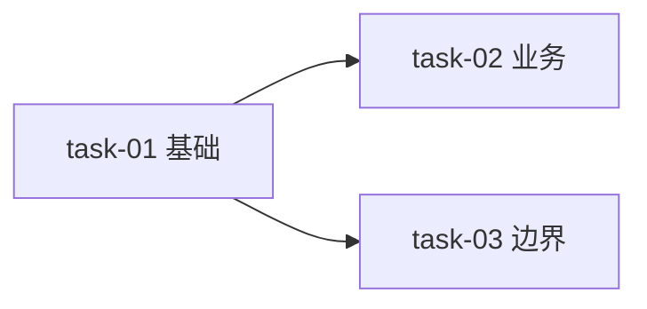

# {feature} — 实施方案

> 产物路径：`develop/features/{feature}/{feature}-implementation-plan.md`
> 上游：{feature}-design.md、{feature}-requirement.md、project-context.md
> 下游：确认后据此执行 TDD 落地（产出 src/ 代码 + tasks/ 任务追踪）；dev-review 据此核对实现符合度。
>
> 这是 **feature 级、代码级** 的实施方案：精确到文件、签名、伪代码、测试用例，严格遵循红绿 TDD。
> dev-implement 先产出本方案 → 向用户阐述 → 一次性询问是否执行 → 确认后才进入 TDD 落地。
> 本文件不止是任务板，而是可直接据此写代码的完整蓝图。

- **方案日期**：YYYY-MM-DD
- **状态**：草案 / 已确认 / 执行中 / 已完成

---

## 1. 实施概述

- **目标**：（一句话，对齐 requirement 第 1 章）
- **范围**：（本次实施覆盖哪些验收点，不覆盖哪些）
- **关联上游**：
  - 需求：`{feature}-requirement.md`（第 4 章验收标准）
  - 方案：`{feature}-design.md`（第 4 接口 / 第 5 数据 / 第 6 类 / 第 7 流程）
- **实施策略摘要**：（整体怎么落地，分几个任务，关键风险）

## 2. 实施总览

### 2.1 任务拆解清单

> 状态随执行实时更新。方案阶段全为「未实施」；执行期每完成一个任务即更新为「已完成」，进行中为「进行中」。

| 任务编号 | 标题 | 依赖 | 验收点 | 状态 |
|---|---|---|---|---|
| task-01 | ... | 无 | AC1 | 未实施 |
| task-02 | ... | task-01 | AC2 | 未实施 |

**状态取值**：`未实施` → `进行中` → `已完成`（执行期流转，每完成一个任务立即更新本表）

### 2.2 依赖与执行顺序

> 用 mermaid 画任务依赖，确定执行顺序。



**执行顺序**：task-01 → task-02 → task-03（按依赖拓扑，无依赖可并行）。

## 3. 代码级总设计

> 本节是整体代码蓝图，逐任务的细节见第 4 节。与 design 第 4/5/6 章对齐，dev-review 据此核对。

### 3.1 文件结构变更

> 新建/修改/删除的文件，标明类型与职责。代码在仓库根 src/，遵循 project-context 第 3 章。

| 操作 | 路径 | 职责 |
|---|---|---|
| 新建 | `src/modules/{feature}/{name}.{ext}` | {职责} |
| 修改 | `src/modules/{feature}/{other}.{ext}` | {改动点} |
| 新建 | `tests/{feature}/{name}.test.{ext}` | {测试职责} |

### 3.2 模块/分层结构

> 本 feature 在项目分层中的位置，依赖方向。

```text
src/modules/{feature}/
├── {name}.{ext}        # {职责}
├── {name}.{ext}        # {职责}
└── ...
```

### 3.3 数据结构与类型定义

> 本 feature 引入的具体类型/数据结构代码（与 design 第 5 章对齐）。

```text
type {Name} = {
  {field}: {type}   // {说明}
}
```

### 3.4 接口/函数签名总表

> 所有要实现的接口与函数签名汇总（与 design 第 4/6 章对齐）。

```text
// {模块/类}
class {Name} {
  {method}({params}): {returnType}   // {职责}
}
function {name}({params}): {returnType}   // {职责}
```

## 4. 逐任务实施方案

> 每个任务一组，代码级精确，严格红绿 TDD。执行期在 tasks/{feature}-task-NN.md 追踪状态。

### task-01：{标题}

**目标**：{一句话}
**关联**：requirement AC{N} / design 第 {N} 章
**验收点**：
- [ ] Given ...，When ...，Then ...

**涉及文件**：
- [新建] `src/...` — {职责}
- [新建] `tests/...` — {测试职责}

**函数/类签名**：
```text
function {name}({params}): {returnType}   // {职责}
```

**关键逻辑（伪代码）**：
```text
{name}({params}):
  校验输入
  计算/查询
  返回结果 / 抛出 {错误}
```

**测试用例（Red 先写）**：
- `{test_name}`（对应验收点1）— {断言意图}
- `{test_name}`（边界/异常）— {断言意图}

**TDD 执行步骤**：
1. Red：写上述测试 → 运行确认失败
2. Green：写最小实现 → 运行确认通过
3. Refactor：重构（测试不变）→ 运行确认仍绿

### task-02：{标题}

（同上结构）

## 5. 测试策略

### 5.1 TDD 红绿循环

- **后端代码：严格红绿 TDD，无例外。** 业务逻辑/数据访问/接口/算法必须 Red→Green→Refactor。
- **前端代码：尽量红绿，UI 视图层可酌情。** 纯逻辑（hooks/工具函数/状态计算）仍走红绿；视觉/布局/动效等难测视图可后置补测或用快照/视觉测试替代，但**必须在该任务方案中注明「前端 UI，TDD 酌情」并写明替代验证方式**，不可静默跳过。

每个任务严格走 Red → Green → Refactor，硬检查点见 references/TDD纪律.md：
- 无失败测试不许写实现
- 必须实际运行确认红/绿
- Green 后只许重构，不许改测试逻辑
- 一个任务闭环走完才进下一个

### 5.2 测试组织

- 单元测试：与实现同目录或 `tests/` 镜像，遵循 project-context 第 5 章
- 测试命名表达意图：`{模块}_{场景}_{预期}`
- mock 边界：只 mock 外部依赖，不 mock 被测对象

### 5.3 覆盖矩阵

> 验收点 ↔ 任务 ↔ 测试 三者可追溯。dev-review 据此核对覆盖。

| 验收点 (AC) | 任务 | 测试用例 | 状态 |
|---|---|---|---|
| AC1 | task-01 | `{test_name}` | 待确认 |
| AC2 | task-02 | `{test_name}` | 待确认 |
| AC3（边界） | task-03 | `{test_name}` | 待确认 |

## 6. 风险与注意事项

- **技术风险**：（实现难点/外部依赖/性能）及应对
- **兼容风险**：（对现有模块的影响）及应对
- **注意事项**：（执行期需特别留意的点）

## 7. 执行确认

> 方案阐述完毕后，向用户一次性询问是否执行。
> 确认后进入执行阶段：按第 2.2 执行顺序逐任务走第 4 节的 TDD 步骤，产出 src/ 代码与 tasks/ 追踪。

- **询问**：以上实施方案是否确认执行？（确认 / 调整后执行 / 暂不执行）
- **确认结果**：（待用户回应）
